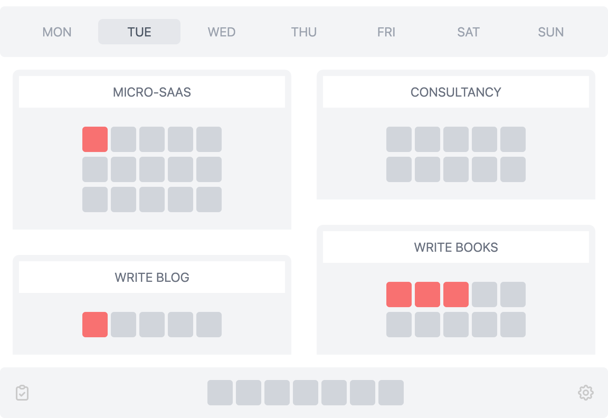

FOCUS
=====

A simple Vue.js based Single Page Application (SPA) to manage my weekly focussed time (40hrs) divided into 4 main areas.



The idea is to not manage time, but make sure core focus areas get the attention you want on a weekly basis. The UI gives a progress of your weekly goal and helps you infer whether you are wasting time with not so important tasks (busy in productivity theatre) or doing the tasks that matter the most to you.

Anything outside of those items, are an overhead or errands, which shouldn't steal away your time, hence has lower visual priority as well.
I copy my Basecamp2's API JSON in localStorage for this to load, but you simply need a JSON in the following format:

```
[
  {
    "id": 1,
    "content": "Launch rocket",
    "completed": true
  },
  {
    "id": 2,
    "content": "Short Banks",
    "completed": true
  },
  {
    "id": 3,
    "content": "Buy Bitcoin",
    "completed": true
  },
]
```

Currently I keep it open on one screen along side terminal while I work. I always want this in front of my eyes. You can set it as your Chrome's new tab view as well but you will have to run your local server for it.